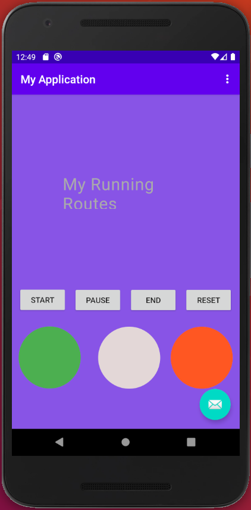

# my-running-routes
Android app for tracking and analyzing running routes

## Overview
My Running Routes is a work in progress. When fully implemented will let you record GPS traces of running routes from most Android devices running Google Play Services. In future releases, you will be able to upload runs to any private server running the dashboard from this repository and compare runs on an OpenStreetMap-backed web site.

## Requirements
- Android 4.2
- Android Studio
- Android SDK 10
- Google Play Services
